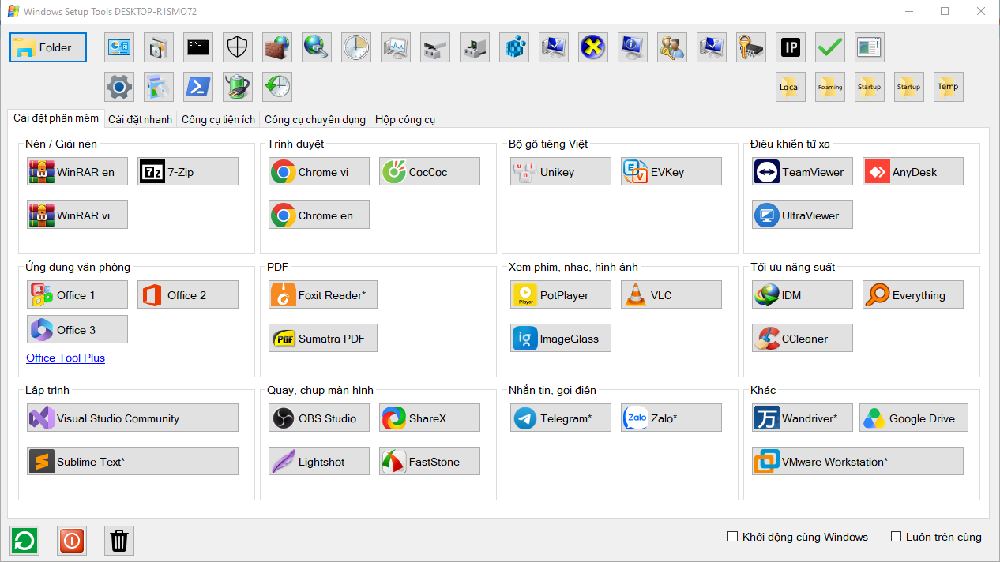
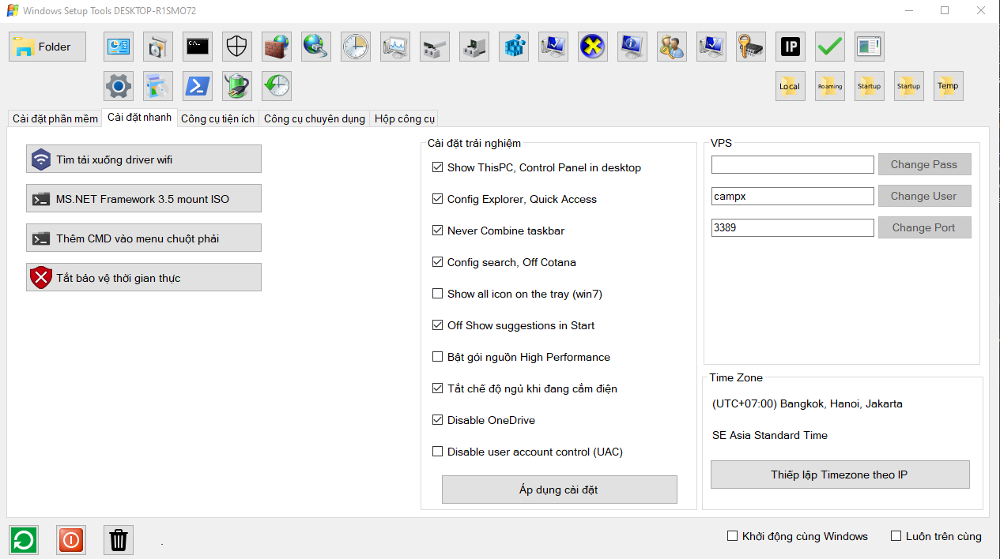
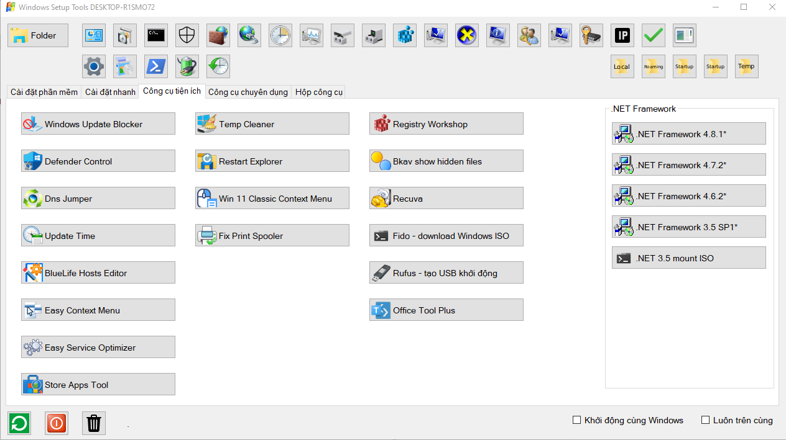
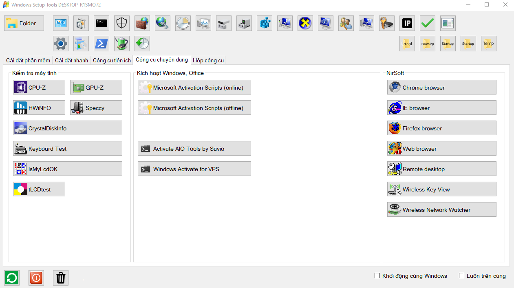
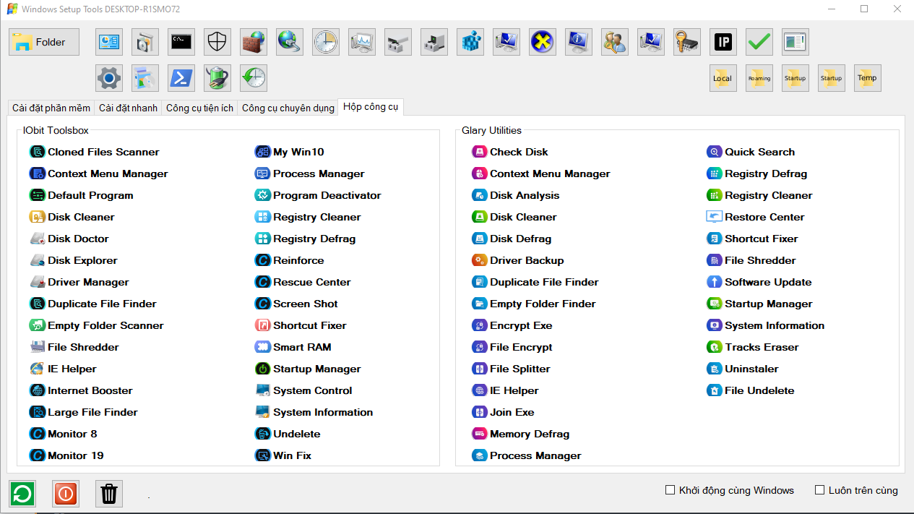

# WindowsSetupTools

> Đơn giản hóa các cài đặt phần mềm, cài đặt trải nghiệm cho máy tính sau khi cài Windows

---

## ✨ Tải xuống

<a href="https://github.com/CamPro/WindowsSetupTools/raw/refs/heads/main/WindowsSetupTools/bin/Release/WindowsSetupTools.exe">WindowsSetupTools.exe</a>

---

## ✨ Tính năng

* ✅ Cài đặt phần mềm
* ✅ Cài đặt trải nghiệm
* ✅ Truy cập nhanh một số chức năng
* ✅ Cung cấp một số công cụ cho kỹ thuật viên
* ✅ Nhỏ gọn, tiện lợi, hiệu quả. Chạy ngay mà không cần cài thêm thư viện.

---

## 🚀 Bắt đầu

### Yêu cầu

* Máy tính có NET Framework
* Kết nối internet

## 📸 Ảnh minh họa

---

## 🛠️ Công nghệ sử dụng

* Ngôn ngữ C#
* .NET Framework 4.7.2

---

## ⭐ Hỗ trợ

Nếu dự án hữu ích, hãy cân nhắc:

* ⭐ Star repository
* 🍴 Fork dự án
* 🐞 Báo lỗi hoặc gửi Pull Request
* 📢 Chia sẻ với mọi người
